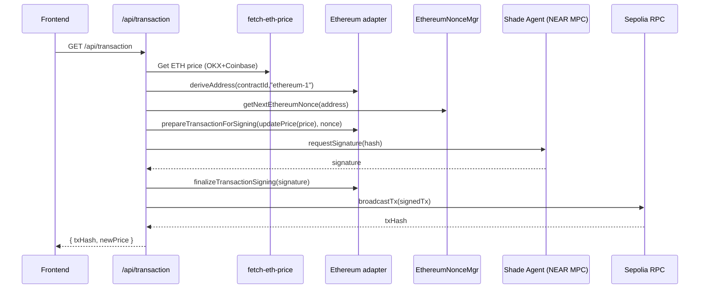
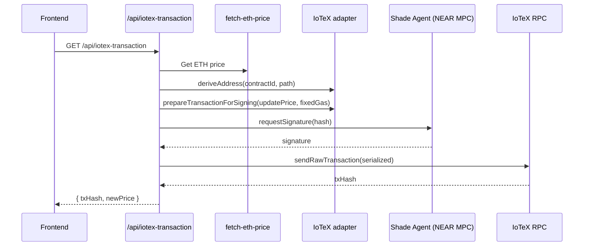
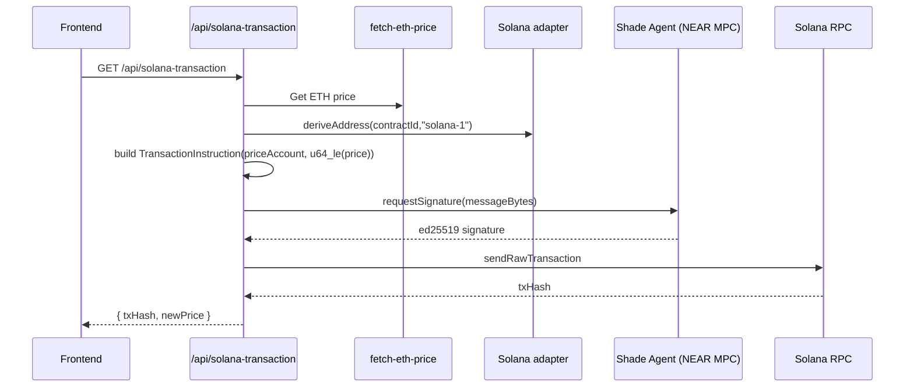

### Shade Agent Template — File-by-file audit (with flow charts)

This repo is a Shade Agent template that fetches ETH price, signs via NEAR MPC, and updates on-chain price oracles across Ethereum (Sepolia), IoTeX, and Solana, with a small frontend and deployment tooling.

## High-level architecture

```mermaid
graph TD
  U[User / Frontend] -->|HTTP| APP[Hono API Server (Node)]
  subgraph API Routes
    APP --> RA[/agent-account/]
    APP --> RE[/eth-account/]
    APP --> RT[/transaction/]
    APP --> RI[/iotex-account/]
    APP --> RIT[/iotex-transaction/]
    APP --> RS[/solana-account/]
    APP --> RST[/solana-transaction/]
    APP --> RP[/price/]
    APP --> LS[/logs/stream (SSE)/]
  end

  RT --> P[getEthereumPriceUSD]
  RIT --> P
  RST --> P

  subgraph Utils
    P --> OKX[OKX API]
    P --> CB[Coinbase API]

    RT --> EVM[Ethereum adapter]
    RIT --> IOTEX[IoTeX adapter]
    RST --> SOL[Solana adapter]

    RT --> EN[getNextEthereumNonce]
    APP --> LOG[logStream (SSE)]
    RT --> NM[nonceManager (NEAR nonce control)]
    RIT --> NM
    RST --> NM
  end

  subgraph MPC via Shade Agent
    NM --> SA[@neardefi/shade-agent-js]
  end

  EVM --> ETH[Sepolia RPC]
  IOTEX --> IORPC[IoTeX RPC]
  SOL --> SOLRPC[Solana RPC]

  RT --> ETHC[PriceOracle.sol]
  RIT --> IOTXC[PriceOracle.sol]
```

## Backend (Node, Hono)

- `src/index.ts`
  - Bootstraps Hono server, CORS (open), health check, mounts routes, SSE logs.
  - Env: `.env.development.local` in dev; `NEXT_PUBLIC_contractId` required.
  - Endpoints:
    - `/api/agent-account`, `/api/eth-account`, `/api/transaction`
    - `/api/iotex-account`, `/api/iotex-transaction`
    - `/api/solana-account`, `/api/solana-transaction`
    - `/api/price`, `/api/logs/stream`

- Routes
  - `src/routes/agentAccount.ts`
    - GET `/api/agent-account`: NEAR agent accountId and balance via `@neardefi/shade-agent-js`.
  - `src/routes/ethAccount.ts`
    - GET `/api/eth-account`: Derives EVM address from `contractId`, returns Sepolia balance via `Evm`.
  - `src/routes/transaction.ts`
    - GET `/api/transaction` (Sepolia):
      - Fetches ETH price, derives sender, gets next nonce, encodes `updatePrice(uint256)`, requests MPC signature, finalizes, broadcasts.
      - Uses: `getEthereumPriceUSD`, `getNextEthereumNonce`, `Evm.prepareTransactionForSigning`, `nonceManager.requestSignature`.
  - `src/routes/iotexAccount.ts`
    - GET `/api/iotex-account?network=testnet|mainnet`: Derives IoTeX address, returns balance using network-specific adapter.
  - `src/routes/iotexTransaction.ts`
    - GET `/api/iotex-transaction` (IoTeX Testnet):
      - Fetches ETH price, encodes `updatePrice`, prepares a type-0 legacy tx with fixed gas via custom adapter, MPC-signs, serializes (ethers), broadcasts with `viem`.
      - Has debug mode `?debug=1` to return tx shape without signing/broadcasting.
  - `src/routes/solanaAccount.ts`
    - GET `/api/solana-account?network=devnet|mainnet`: Derives Solana address, returns balance.
  - `src/routes/solanaTransaction.ts`
    - GET `/api/solana-transaction` (Devnet):
      - Requires `SOLANA_PROGRAM_ID`, `SOLANA_PRICE_ACCOUNT`.
      - Fetches price, builds instruction containing a u64 LE price, requests ed25519 signature via MPC, attaches, broadcasts.
  - `src/routes/price.ts`
    - GET `/api/price`: Average ETH price from OKX + Coinbase, returns cents and metadata.
  - `src/routes/nonceControl.ts`
    - GET `/api/nonce-control/status`, POST `/toggle`, POST `/reset`: Toggles and resets NEAR nonce behavior demo and resets local ETH nonce tracking.

- Utils
  - `src/utils/ethereum.ts`
    - Sepolia RPC URL, `ethContractAddress`, ABI for `PriceOracle`, `Evm` adapter via `chainsig.js`.
  - `src/utils/ethereumNonceManager.ts`
    - Tracks last used nonce per EVM address in-memory; returns next nonce using max(latest,pending,tracked); reset API.
  - `src/utils/iotex.ts`
    - IoTeX RPCs, addresses, ABI, custom `IoTeXAdapter` wrapping EVM adapter; manually constructs legacy tx (type 0), fixed gas, derives sign-hash, returns `hashesToSign`.
    - `iotexChainConfig`, `getIoTeXAdapter`, `getIoTeXPath`.
  - `src/utils/iotex-fixed-gas.ts`
    - Alternative IoTeX adapter using modified params; retained alongside `iotex.ts`. Not used by routes (kept for reference).
  - `src/utils/solana.ts`
    - Solana RPCs, Shade MPC contract, adapters for devnet/mainnet; `getSolanaPath`, `getSolanaAdapter`.
  - `src/utils/fetch-eth-price.ts`
    - OKX and Coinbase fetchers, average, returns integer cents.
  - `src/utils/nonceManager.ts`
    - Wraps `requestSignature` from Shade lib; maintains monotonic NEAR access key nonces across requests with lock and optional increment toggle.
  - `src/utils/logStream.ts`
    - Hooks `console.*` to publish to ring buffer; SSE endpoint writer for `/api/logs/stream`.

## Smart contract (EVM)

- `contracts/PriceOracle.sol`
  - Minimal ownable oracle with `updatePrice(uint256)`, `getPrice()`, `transferOwnership(address)`.
  - Owner set to deployer. Only owner can update the price.

## Scripts (Hardhat)

- `hardhat.config.js`
  - Solidity 0.8.19, optimizer on.
  - Networks: IoTeX Testnet/Mainnet via `PRIVATE_KEY`. Artifacts configured to repo paths.

- `scripts/generate-wallet.js`
  - Generates random wallet and outputs `PRIVATE_KEY`; instructs funding and deploy command.

- `scripts/deploy-iotex.js`
  - Deploys `PriceOracle` to selected network, logs address, tx hash, and explorer link.

## Frontend (Vite React)

- `frontend/src/config.js`
  - `API_URL` default `http://localhost:3000`; allow switching to Phala URL.

- `frontend/src/networks.js`
  - Defines Sepolia and IoTeX testnet network metadata, contract addresses, and mapped API endpoints.

- `frontend/src/App.jsx`, `MultiChainDemo.jsx`, etc.
  - Demo UI that hits the API endpoints, displays balances, sends txs, and streams logs.

## Containerization & Deployment

- `Dockerfile`
  - Multi-stage Node 22 Alpine build; `npm ci`, `tsc` build to `dist`, runs `npm start`.

- `docker-compose.yaml`
  - Two services:
    - `shade-agent-api`: prebuilt image for the Shade Agent backend, mounts `/var/run/tappd.sock`, no public ports.
    - `shade-agent-app`: prebuilt app image exposed on 3000, mounts the same socket, used for UI/API. Env `NEXT_PUBLIC_contractId`.
  - Note: Compose uses prebuilt images; not the local `Dockerfile`. The `package.json` also includes a local docker build script (`pivortex/my-app`). Choose one strategy and keep addresses/envs consistent.

- `package.json`
  - Scripts: `dev` (tsx), `build`, `start`, docker build/push, Phala deploy, wallet/gen, deploy/compile.
  - Deps: `@neardefi/shade-agent-js`, `chainsig.js`, `ethers`, `hono`, `@hono/node-server`, `@solana/web3.js`, `cors`, `dotenv`.

## Transaction flows

- EVM (Sepolia)


- IoTeX (Testnet, legacy tx with fixed gas)


- Solana (Devnet)


## Key observations and risks

- CORS is fully open by default; consider restricting origins.
- In-memory nonce tracking (`ethereumNonceManager`, `nonceManager`) is per-process. Multi-instance deployments risk nonce collisions. Add persistent or distributed tracking.
- `nonceControl` endpoints are unauthenticated; toggling or reset could be abused. Add auth for non-demo contexts.
- Hardcoded contract addresses in `ethereum.ts`, `iotex.ts`, and `frontend/src/networks.js`. Keep them synchronized with actual deployments.
- IoTeX path uses EVM path (`ethereum-1`) and custom fixed-gas legacy signing; verify `v`/chainId correctness across clients and RPC nodes.
- External price sources lack explicit timeouts/retries/caching; risk of latency/DoS via repeated calls.
- Secrets (NEAR seed phrase, PRIVATE_KEY) must not be exposed via logs; ensure .env not committed and limit logs.
- docker-compose uses prebuilt images rather than local build; confirm which is authoritative to avoid drift between code and containers.
- `shade-agent-api` port is not exposed—good—but verify `shade-agent-app` is the only public entrypoint.
- SSE logs: All `console.*` output is broadcast to `/api/logs/stream`. Avoid sensitive info in logs.
- Solana config relies on `SOLANA_PROGRAM_ID` and `SOLANA_PRICE_ACCOUNT`; ensure these are set in env for Solana flows.
- PriceOracle.sol is simple and owns price; ensure ownership is transferred to the NEAR-derived EVM/IoTeX address that the MPC controls.
- Frontend points to `API_URL`; ensure it matches your deployment and the network contracts in `networks.js`.
- Hardhat deploy uses your `PRIVATE_KEY`; keep it secure.
- Dockerfile builds and runs the local server (`dist/index.js`). Not used by docker-compose images as-is.
- Phala deployment script in `package.json` uses `docker-compose.yaml` and `.env.development.local`. Keep envs consistent.
- `chainsig.js` and `@neardefi/shade-agent-js` are central dependencies; pin versions that you’ve tested.
- Viem is dynamically imported in IoTeX route; ensure it’s available in runtime (consider adding explicit `viem` dependency).
- Unused alternative IoTeX adapter file (`iotex-fixed-gas.ts`) is present; document or remove to avoid confusion.
- Rate limits: Coinbase and OKX may rate limit; consider caching price server-side.
- Error handling logs to SSE; useful for observability.
- Security: No auth on transaction endpoints; demo context may be OK, but consider adding auth or rate limiting before public exposure.
- Liveness: `/` health check returns JSON; good for probes.
- Env dependency: `NEXT_PUBLIC_contractId` must be present for almost all routes.
- Nonce increment demo: Feature toggle is helpful for demos of replay protection but should be guarded in prod.
- Contracts: No Pausable or Guard in `PriceOracle.sol`; owner-only write is OK for demo.
- Endpoint semantics: All tx APIs use GET; consider POST for side effects.
- Numeric conversions: IoTeX and EVM use `uint256` cents; Solana packs `u64` LE; ensure consistency across chains.
- Logs: Good ring buffer; can memory grow if high log volume? Buffer is capped at 300 events.
- Timeouts: Network operations lack explicit timeouts; consider adding.
- Frontend: Large demo components; ensure `API_URL` and networks are aligned.
- Docker platform set to `linux/amd64` in compose for TDX compatibility.
- Socket: `/var/run/tappd.sock` used by Shade Agent; ensure the host runtime provides it (Phala Cloud).
- RPC endpoints: Public RPCs; consider providers with rate limits or keys.
- Eth nonce selection uses max(pending,latest,tracked). Good resilience to in-flight tx.
- IoTeX broadcasting via viem `sendRawTransaction` is straightforward; block number not returned immediately—documented in response.
- SSE endpoint path: `/api/logs/stream`; frontend can subscribe.
- `tsconfig.json`, `tsx` used for local dev.
- License present (MIT).
- README instructs end-to-end; docs link to NEAR docs.
- Compose images are pinned by digest; reproducible.
- Dockerfile uses `npm ci --only=production` for deps and dev deps separation—good.
- Build script names (`pivortex/my-app`) may be placeholders.
- Frontend `config.js` warns against trailing slash—good minor DX note.
- Hardhat optimizer runs set to 200; fine for demo.
- `shade-agent-js.d.ts` in `src/` likely a stub; code uses official package types.
- Artifacts and cache directories included; ensure not too heavy in repo.
- Scripts directory contains many demo/test scripts; ensure they’re clearly marked as demo.
- The repo name indicates “sandbox template”; production hardened measures are left to adopters.
- Default open CORS and unauthenticated toggles: leave as-is for dev; lock down for prod.
- Use of GET for tx endpoints: switch to POST in prod, with CSRF or auth.
- Error paths return generic 500 with message; decent but could expose details via SSE logs.
- Env var `NEAR_ACCOUNT_ID/SEED` only used by shade-agent-api container in compose; local server doesn’t use them directly.
- Compose: Ensure only app service has public exposure; keep API socket internal.
- Node 22 Alpine is current; good baseline.
- ABI duplication: PriceOracle ABI repeated in multiple files; consider centralizing.
- Unused files: `iotex-fixed-gas.ts` appears unused; document or remove.
- Compatibility: IoTeX legacy tx path uses ethers Transaction serialization; validated in route.
- Frontend UX: MultiChain Demo UI to exercise endpoints; set `API_URL` accordingly.

## Quick mapping of key files to responsibilities

- API server: `src/index.ts`
- EVM price tx: `src/routes/transaction.ts` + `src/utils/ethereum.ts` + `src/utils/ethereumNonceManager.ts`
- IoTeX price tx: `src/routes/iotexTransaction.ts` + `src/utils/iotex.ts`
- Solana price tx: `src/routes/solanaTransaction.ts` + `src/utils/solana.ts`
- MPC signature handling: `src/utils/nonceManager.ts` + `@neardefi/shade-agent-js`
- Price fetching: `src/utils/fetch-eth-price.ts`
- SSE logs: `src/utils/logStream.ts`
- Smart contract: `contracts/PriceOracle.sol`
- Frontend config: `frontend/src/config.js`, `frontend/src/networks.js`
- Deployment: `docker-compose.yaml`, `Dockerfile`, `hardhat.config.js`, `scripts/*`
- Env: `.env.development.local` (doc’d in README)

## Recommended hardening

- Restrict CORS, add auth/rate limiting to tx and toggle endpoints.
- Persist nonce tracking or use on-chain nonce exclusively with careful concurrency.
- Add timeouts/retries/caching for price API.
- Align contract addresses across backend and frontend; switch tx endpoints to POST.
- Add `viem` to root `package.json` dependencies.

## Environment variables to set

- `NEXT_PUBLIC_contractId` (all chains)
- `SOLANA_PROGRAM_ID`, `SOLANA_PRICE_ACCOUNT` (Solana route)
- `PRIVATE_KEY` (for Hardhat deploys if used)

## External services

- RPCs: Sepolia, IoTeX, Solana
- OKX/Coinbase price APIs
- NEAR Shade Agent MPC via `@neardefi/shade-agent-js` and `chainsig.js`

## Data model

- Price in cents (`uint256` on EVM/IoTeX; `u64` LE on Solana).

## Build/run

- Dev: `npm run dev` (Node API), `frontend` via Vite.
- Build: `npm run build` -> `dist`, `npm start`.
- Docker: Multi-stage; compose uses prebuilt images instead.

## Contract deployment

- Generate wallet, fund, deploy to IoTeX testnet/mainnet via scripts.
- Ensure on-chain owner matches MPC-derived address used for updates.

## Overall

- Template is coherent and well-structured for sandbox usage; requires hardening for production.
- No formal security audit; this is an architectural/logic review.
